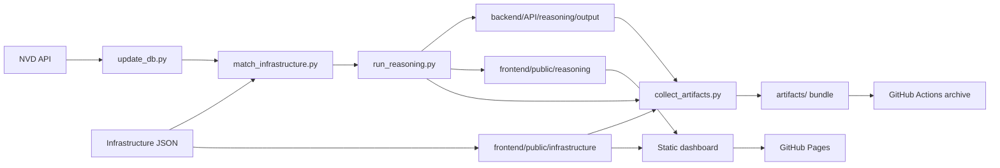

# Data Engineering MLOps Exam

This repository implements a security intelligence pipeline for a mock logistics company. It ingests NVD CVE data into a local SQLite database, matches that data against a mock infrastructure inventory, runs a two-stage reasoning pass, and publishes the results as a static dashboard.

The project is organized around three operational layers:

1. NVD ingestion and database refresh.
2. Infrastructure matching and remediation tracking.
3. Reasoning export, artifact collection, and static publishing.

## Overview

The main goal is to produce actionable vulnerability findings from infrastructure context, then surface those findings in a GitHub Pages-ready frontend.

The key design choices are:

- Use a local SQLite database for portability and simple automation.
- Keep the NVD updater as the authoritative source of refresh logic.
- Store raw matcher output and LLM reasoning output separately.
- Mirror the latest JSON into the static frontend so GitHub Pages can render it without a backend.
- Package the refresh pipeline so it can run locally in Docker or in GitHub Actions.

## Project Architecture



The diagram reflects the intended operating model:

- The NVD updater is the source of truth for CVE refreshes.
- Matching combines the refreshed CVE database with the infrastructure inventory.
- Reasoning enriches the findings and publishes JSON for the frontend.
- Artifact collection packages every generated output for CI and archival use.
- GitHub Pages serves the static dashboard directly from mirrored JSON.

## Repository Layout

- [backend/API/](backend/API/) contains ingestion, matching, reasoning, and operational scripts.
- [backend/infrastructure/](backend/infrastructure/) contains the mock company inventory and asset JSON inputs.
- [frontend/](frontend/) contains the static dashboard, remediation page, and infrastructure overview.
- [.github/workflows/](.github/workflows/) contains the GitHub Pages deployment workflow and the refresh-and-collect workflow.
- [data/db/](data/db/) stores the live SQLite database and timestamped snapshots.
- [data/log/](data/log/) stores updater logs and run summaries.
- [backend/API/reasoning/output/](backend/API/reasoning/output/) stores backend reasoning exports.
- [frontend/public/reasoning/](frontend/public/reasoning/) and [frontend/public/infrastructure/](frontend/public/infrastructure/) contain mirrored JSON for the static site.
- [artifacts/](artifacts/) is the collected bundle produced by the refresh pipeline and should not be committed.

## Data Flow

The pipeline runs in this order:

1. `backend/API/scripts/update_db.py` refreshes the NVD dataset in SQLite.
2. `backend/API/scripts/match_infrastructure.py` rebuilds CVE-to-asset findings from the inventory.
3. `backend/API/scripts/run_reasoning.py` performs the two-stage reasoning pass and writes JSON exports.
4. `backend/API/scripts/collect_artifacts.py` copies the generated trees into `artifacts/` and writes a manifest plus matching summary.

The reasoning layer has two modes:

- Hosted Groq-backed reasoning for live runs.
- Deterministic heuristic fallback for local validation and CI-safe dry runs.

## Quick Start

Install dependencies and run the pipeline directly:

```bash
python -m pip install -r requirements.txt
uv run python backend/API/scripts/update_db.py --sleep-seconds 0
uv run python backend/API/scripts/match_infrastructure.py
uv run python backend/API/scripts/run_reasoning.py --limit 50
```

To run the full collector and produce a bundle under `artifacts/`:

```bash
uv run python backend/API/scripts/collect_artifacts.py --artifact-dir artifacts --reasoning-limit 50 --nvd-sleep-seconds 0
```

If you want to skip one or more stages, the collector supports `--skip-update`, `--skip-match`, and `--skip-reasoning`.

## Local Dashboard

The frontend is a static site. Open the HTML files directly or serve the `frontend/` directory.

Recommended local run with Docker Compose:

```bash
docker compose up frontend
```

This serves the dashboard on port `4173`.

The frontend includes:

- Dashboard: [frontend/index.html](frontend/index.html)
- Remediation view: [frontend/remediation.html](frontend/remediation.html)
- Infrastructure view: [frontend/infrastructure.html](frontend/infrastructure.html)

## Reasoning Outputs

The reasoning runner writes three important JSON artifacts:

- `latest_reasoning.json` for the full per-finding report.
- `latest_summary.json` for dashboard statistics.
- `latest_raw_summary.json` for matcher-only statistics before the LLM layer.

These are mirrored into [frontend/public/reasoning/](frontend/public/reasoning/) so the static site can fetch them without a backend.

## Infrastructure Data

The mock company model represents NordCargo Logistics ApS and includes:

- Headquarters plus five cargo bays.
- Servers, workstations, and network devices.
- Departments, sites, company metadata, and public exposure.

The repository memory also reflects the modeled environment:

- HQ01 plus five cargo bays.
- Seven servers, nine workstations, and nine network devices.
- Department headcounts that sum to 42 employees.

The mirrored frontend inventory lives under [frontend/public/infrastructure/](frontend/public/infrastructure/).

## GitHub Actions

The refresh workflow is designed for two use cases:

- Scheduled refreshes that keep the dataset current.
- Manual refreshes when you want to force an update or increase reasoning coverage.

The workflow:

1. Updates the NVD database.
2. Re-runs infrastructure matching.
3. Runs reasoning with a configurable limit or full pass.
4. Collects all generated artifacts.
5. Uploads the bundle.
6. Deploys the static site to GitHub Pages.

The default policy keeps reasoning incremental unless you explicitly request a full pass, which avoids excessive API usage on large finding sets.

## GitHub Actions & Pages (setup)

How to publish and keep the static site updated:

- Add repository Secrets: `GROQ_API_KEY`, `GROQ_REASONING_MODEL`, and any third-party API keys your reasoning runner needs. If workflows must connect to an external DB add `DATABASE_URL`.
- The repo already contains workflows in `.github/workflows/`:
	- `update_cves.yml` — daily CVE refresh (runs at 07:00 UTC).
	- `refresh-artifacts.yml` — scheduled full refresh + Pages deploy (runs at 07:00 UTC).
	- `pages.yml` — deploys `frontend/public` to GitHub Pages on push to `main`.
	- `ci.yml` — lints, type-checks, and runs unit tests on push/PR.
	- `db-tests.yml` — spins up a Postgres service and runs DB tests (daily at 07:00 UTC).

Steps to enable Pages and Secrets:

1. In GitHub, go to Settings → Pages and set the source to the `gh-pages` deployment (the Actions workflows use the official Pages actions and publish `frontend/public`).
2. Add the Secrets (Repository → Settings → Secrets & variables → Actions): `GROQ_API_KEY`, `GROQ_REASONING_MODEL`, and `DATABASE_URL` (if applicable).
3. Optionally protect `main` branch and ensure Actions can push (adjust permissions in Settings → Actions).

Notes:

- GitHub Pages is static only; it cannot host a live database or API. This project uses Actions to run the ingestion/matching/reasoning on ephemeral runners and then mirrors the generated JSON into `frontend/public/` so the static site can read it.
- If you need a live API, host the backend (and DB) externally (Render, Railway, Fly, or a cloud VM) and point the frontend to that API.

## Docker

The repository includes a single Docker image and a Compose file.

Frontend service:

```bash
docker compose up frontend
```

Collector service under the `pipeline` profile:

```bash
docker compose --profile pipeline run --rm collector
```

The Compose setup is intended for local development and automation checks. The collector service runs the full refresh pipeline on demand.

## Configuration

Optional environment variables:

- `GROQ_API_KEY` enables live Groq-backed reasoning.
- `GROQ_REASONING_MODEL` overrides the default reasoning model.

If no API key is present, the reasoning runner falls back to deterministic heuristic outputs so the pipeline still works locally.

## Useful Commands

```bash
uv run python backend/API/scripts/update_db.py --sleep-seconds 0
uv run python backend/API/scripts/match_infrastructure.py
uv run python backend/API/scripts/run_reasoning.py --limit 50
uv run python backend/API/scripts/run_reasoning.py --all
uv run python backend/API/scripts/collect_artifacts.py --artifact-dir artifacts --reasoning-limit 50 --nvd-sleep-seconds 0
docker compose up frontend
docker compose --profile pipeline run --rm collector
```

## Generated Files

The most important generated paths are:

- `data/db/cve.db` for the live database.
- `data/db/cve-*.db` for snapshots.
- `data/log/` for updater and pipeline logs.
- `backend/API/reasoning/output/` for backend reasoning exports.
- `frontend/public/reasoning/` for static dashboard input.
- `frontend/public/infrastructure/` for mirrored inventory data.
- `artifacts/` for the collected release bundle.

## Notes

- The updater bootstraps a fresh database the first time it runs, then continues incrementally.
- `backend/API/scripts/update_db.py` remains the authoritative NVD refresh script.
- The static frontend is intentionally backend-free so it can be published as GitHub Pages content.

## Troubleshooting

If the dashboard shows no data, run the collector or the individual pipeline steps again so the mirrored JSON is regenerated.

If you want fresh reasoning data but do not want to spend extra API calls, use `--limit` instead of `--all`.

If you are validating the pipeline in CI or locally without Groq credentials, use the heuristic fallback mode.
