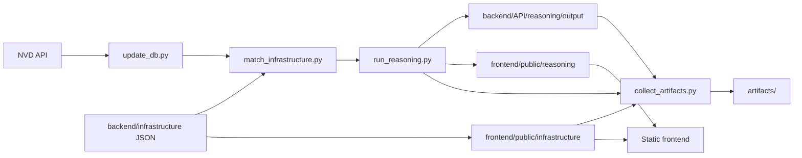

# Data Engineering MLOps Exam

This repository implements a vulnerability intelligence pipeline for a mock logistics company. It ingests NVD CVE data into SQLite, matches that data against a synthetic infrastructure inventory, runs a reasoning pass over the findings, and exports JSON artifacts for a static frontend.

## What This Project Does

The pipeline is designed to turn raw CVE data into actionable output:

1. Refresh the local NVD database.
2. Match CVEs against company assets.
3. Run reasoning over the matched findings.
4. Collect everything into a single artifact bundle.
5. Mirror the latest JSON into the frontend so the site can work without a backend.

The project is intentionally local-first: it uses SQLite, file-based JSON artifacts, and a static frontend.

## Pipeline Overview



The important part is the collector: `collect_artifacts.py` can run the full pipeline end-to-end and then package the generated files.

## Main Scripts

- `backend/API/scripts/update_db.py` refreshes the NVD dataset in SQLite.
- `backend/API/scripts/populate_db.py` performs a historical bootstrap when you want to seed the database from a chosen NVD start index.
- `backend/API/scripts/match_infrastructure.py` generates CVE-to-asset findings from the inventory.
- `backend/API/scripts/run_reasoning.py` runs the reasoning layer over findings.
- `backend/API/scripts/collect_artifacts.py` orchestrates the full refresh and copies outputs into `artifacts/`.
- `backend/API/scripts/explore_db.py` and `backend/API/scripts/query_findings.py` are utility scripts for inspection.
- `backend/API/scripts/mark_patched.py` updates remediation state.

## Repository Layout

- `backend/API/` contains ingestion, matching, reasoning, and operational scripts.
- `backend/infrastructure/` contains the mock company inventory and asset JSON inputs.
- `frontend/` contains the static dashboard and mirrored public data.
- `data/db/` stores the live SQLite database and timestamped snapshots.
- `data/log/` stores updater logs and summaries.
- `backend/API/reasoning/output/` stores backend reasoning exports.
- `frontend/public/reasoning/` and `frontend/public/infrastructure/` contain mirrored JSON for the static site.
- `artifacts/` is the collected bundle produced by the refresh pipeline.

## Running The Pipeline

Install dependencies first:

```bash
python -m pip install -r requirements.txt
```

Then run the full pipeline:

```bash
uv run python backend/API/scripts/collect_artifacts.py --artifact-dir artifacts --nvd-sleep-seconds 7 --reasoning-limit 50
```

That command will:

1. Update the NVD database.
2. Match infrastructure to CVEs.
3. Run reasoning on up to 50 findings.
4. Collect the generated database, logs, reasoning output, infrastructure data, and frontend files into `artifacts/`.

If the database is empty and you want to control the historical NVD bootstrap, pass a start index:

```bash
uv run python backend/API/scripts/collect_artifacts.py --artifact-dir artifacts --nvd-sleep-seconds 7 --nvd-start-index 250000 --reasoning-limit 50
```

You can also run the underlying update script directly:

```bash
uv run python backend/API/scripts/update_db.py --sleep-seconds 0 --start-index 250000
```

Useful collector flags:

- `--skip-update`
- `--skip-match`
- `--skip-reasoning`
- `--reasoning-all`
- `--reasoning-dry-run`
- `--reasoning-model <name>`

## Reasoning

The reasoning layer has two modes:

- Groq-backed reasoning when `GROQ_API_KEY` is set.
- Deterministic heuristic fallback when no API key is available or when `--reasoning-dry-run` is used.

Useful commands:

```bash
uv run python backend/API/scripts/run_reasoning.py --limit 50
uv run python backend/API/scripts/run_reasoning.py --all
```

## Frontend

The frontend is a static site. The main views are:

- `frontend/index.html`
- `frontend/remediation.html`
- `frontend/infrastructure.html`

To serve the frontend locally:

```bash
docker compose up frontend
```

That exposes the site on port `4173`.

The mirrored data used by the frontend lives under `frontend/public/`.

## Docker

The repository includes one Docker image and a Compose file.

The default image command runs the full artifact pipeline, so this works out of the box:

```bash
docker build -t de-mle-exam .
docker run --rm -v "$PWD/artifacts":/workspace/artifacts de-mle-exam
```

The Compose file also provides a dedicated pipeline service:

```bash
docker compose --profile pipeline run --rm collector
```

Use the frontend service when you only want to browse the static site.

## Configuration

Optional environment variables:

- `GROQ_API_KEY` enables live Groq-backed reasoning.
- `GROQ_REASONING_MODEL` overrides the default reasoning model.

If no API key is present, the reasoning runner falls back to deterministic output so the pipeline still works locally and in CI-style runs.

## Generated Files

Important generated paths:

- `data/db/cve.db` for the live database.
- `data/db/cve-*.db` for snapshots.
- `data/log/` for updater and pipeline logs.
- `backend/API/reasoning/output/` for reasoning exports.
- `frontend/public/reasoning/` for frontend input.
- `frontend/public/infrastructure/` for mirrored infrastructure data.
- `artifacts/` for the collected release bundle.

## Troubleshooting

If the dashboard shows no data, rerun the collector so the mirrored JSON is regenerated.

If you want reasoning output for more findings, increase `--reasoning-limit` or use `--reasoning-all`.

If you are validating the pipeline without Groq credentials, rely on the heuristic fallback mode.
